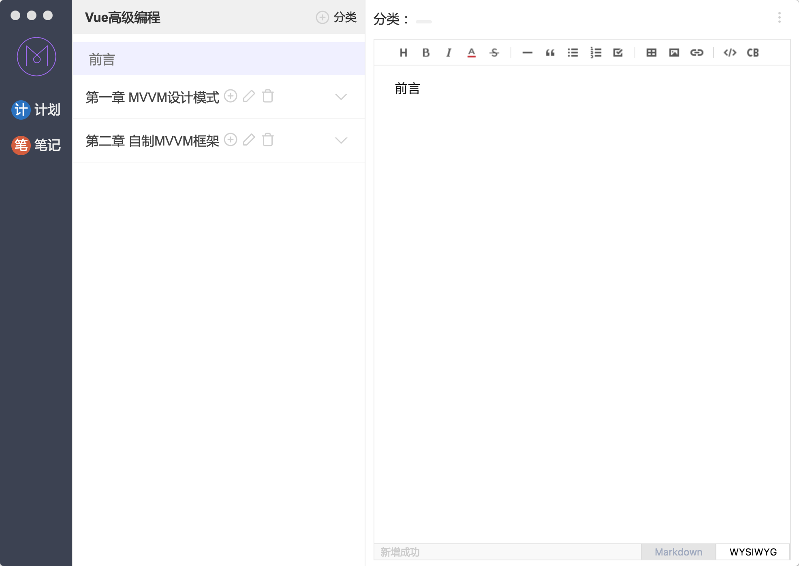

# [Mark](https://lin-xi.github.io/mark/) 2.0.2

https://lin-xi.github.io/mark/

mark 是一个 mac 下的免费开源的 markdown 编辑程序，使用[tui.editor](https://nhnent.github.io/tui.editor/)和 electron 构建。

tui.editor（TOAST UI Editor）是一款所见即所得的 Markdown 编辑器。TOAST UI Editor 提供 Markdown 模式和 WYSIWYG 模式。它的功能非常强大，你可以编辑表格，UML 图和图表等。

### TOAST UI Editor 的 Markdown 模式的特点有：

- 所见即所得。你在编辑 Markdown 的同时，可以预览生成的 HTML 页面。

- 异步滚动。可以在 Markdown 和预览之间进行异步滚动。

- 列表自动缩进。

- 语法高亮。

### TOAST UI Editor 的 WYSIWYG 模式的特点有：

- 可以直接从浏览器，excel，powerpoint 等复制内容并进行粘贴。

- 支持 170+种语言的语法高亮。

- 支持表格。

# 下载安装

[Mark 2.0.2](https://github.com/lin-xi/mark/releases/download/2.0.2/Mark-2.0.2.dmg_02.zip)

[历史版本](https://github.com/lin-xi/mark/releases)

# 主要特色

- 计划 todo 管理
- 支持天，周，月，季，年级别的 todo 定制
- note，笔记管理
- category， 支持分类
- save data on local disk，本地数据存储，支持导入导出数据文件

Mark 致力于做好用的效率提升工具，欢迎交流并提出宝贵意见

# 发布日志 Release Log

## 2.0.2

- [x] 【功能】UI 简化
- [x] 【功能】笔记页面，列表可拖动调整大小
- [x] 【bug】修复 bug

## 2.0.0

- [x] 【功能】新增笔记本管理
- [x] 【功能】简化 todo

## 1.1.3

- [x] 【功能】修改 note 页面分类默认折叠
- [x] 【功能】优化笔记写作界面，写作空间更大
- [x] 【功能】增加分类删除功能
- [x] 【功能】优化可拖动区域
- [x] 【功能】markdown 模式字体大小优化
- [x] 【bug】添加新分类展示类 bug 修复

## 1.1.2

- [x] 【功能】新增折叠列表功能
- [x] 【bug】修复 markdown 模式下，同步滚动的问题
- [x] 【功能】添加文字颜色编辑功能
- [x] 【功能】窗口默认宽度修改为 1200

## 1.1.1

- [x] 【bug】修复 logo 不透明

## 1.1.0

bug 修复

- [x] 【bug】列表区没有设置滚动区域
- [x] 【bug】导出数据，点击取消报错
- [x] 【bug】Note 页面，编辑器没处理 window resize 事件

# 致谢 Special thanks

[electron](https://github.com/electron/electron)

[tui.editor](https://github.com/nhnent/tui.editor)

[nedb](https://github.com/louischatriot/nedb)
