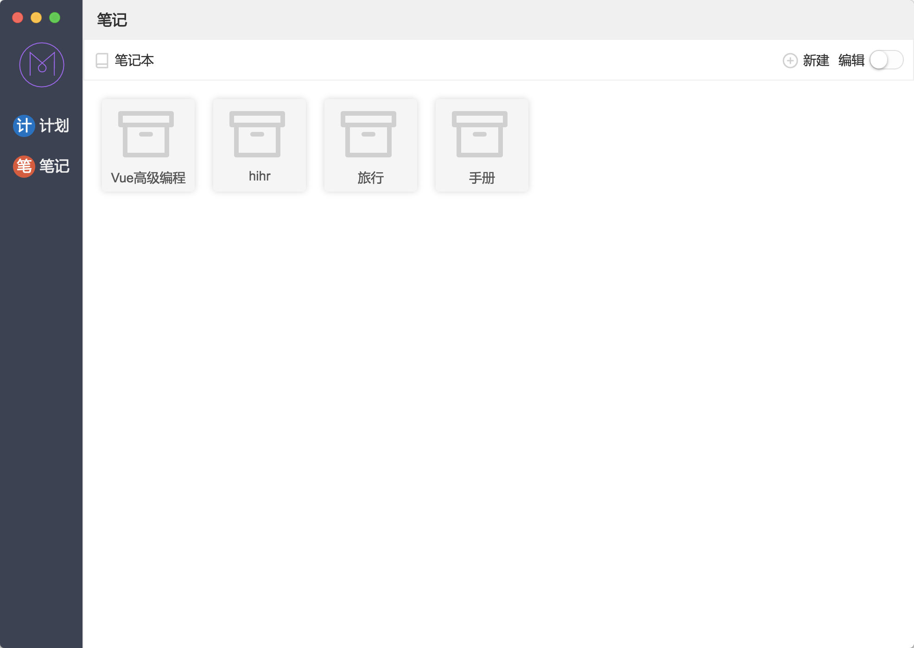

](https://github.com/lin-xi/mark/issues)
]
](https://github.com/lin-xi/mark)

#  [Mark](https://lin-xi.github.io/mark/) 1.1.3

https://lin-xi.github.io/mark/

mark是一个mac下的免费开源的markdown编辑程序，使用[tui.editor](https://nhnent.github.io/tui.editor/)和electron构建。

tui.editor（TOAST UI Editor）是一款所见即所得的Markdown编辑器。TOAST UI Editor提供Markdown模式和WYSIWYG模式。它的功能非常强大，你可以编辑表格，UML图和图表等。

### TOAST UI Editor的Markdown模式的特点有：

+ 所见即所得。你在编辑Markdown的同时，可以预览生成的HTML页面。

+ 异步滚动。可以在Markdown和预览之间进行异步滚动。

+ 列表自动缩进。

+ 语法高亮。

### TOAST UI Editor的WYSIWYG模式的特点有：

+ 可以直接从浏览器，excel，powerpoint等复制内容并进行粘贴。

+ 支持170+种语言的语法高亮。

+ 支持表格。

# 下载安装

[Mark 1.1.3](https://github.com/lin-xi/mark/releases/download/1.1.3/Mark-1.1.3.dmg.zip)

[历史版本](https://github.com/lin-xi/mark/releases)

# 主要特色

+ 计划todo管理
+ 支持天，周，月，季，年级别的todo定制
+ note，笔记管理
+ category， 支持分类 
+ save data on local disk，本地数据存储，支持导入导出数据文件

Mark致力于做好用的效率提升工具，欢迎交流并提出宝贵意见

# 发布日志  Release Log

## 1.1.3
- [x] 【功能】修改note页面分类默认折叠
- [x] 【功能】优化笔记写作界面，写作空间更大

## 1.1.2
- [x] 【功能】新增折叠列表功能
- [x] 【bug】修复markdown模式下，同步滚动的问题
- [x] 【功能】添加文字颜色编辑功能
- [x] 【功能】窗口默认宽度修改为1200

## 1.1.1
- [x] 【bug】修复logo不透明

## 1.1.0
bug修复

- [x] 【bug】列表区没有设置滚动区域
- [x] 【bug】导出数据，点击取消报错
- [x] 【bug】Note页面，编辑器没处理window resize 事件

# 致谢  Special thanks

[electron](https://github.com/electron/electron)

[tui.editor](https://github.com/nhnent/tui.editor)

[nedb](https://github.com/louischatriot/nedb)

